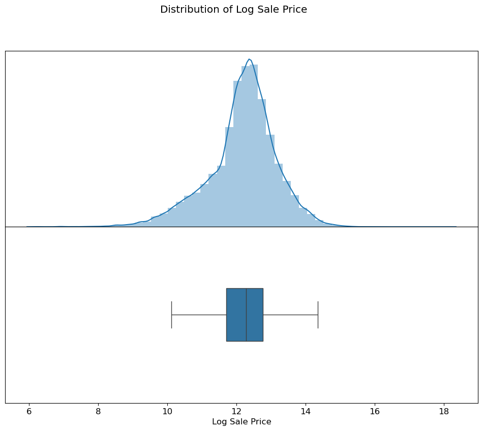
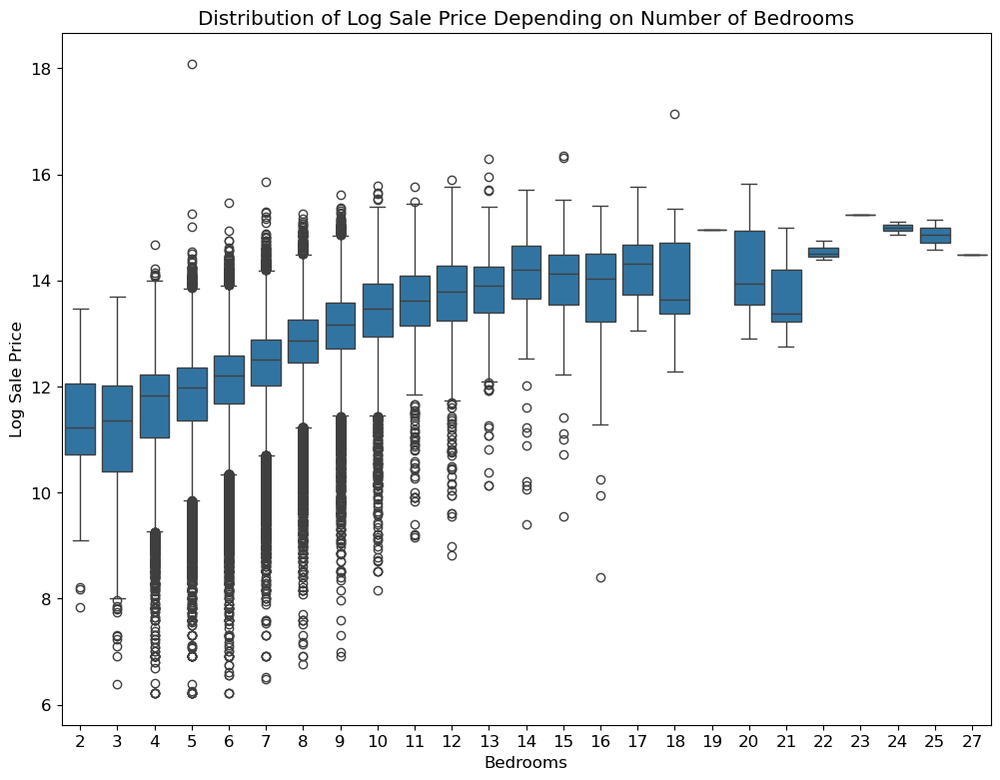
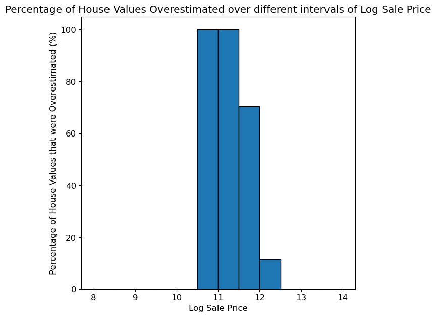
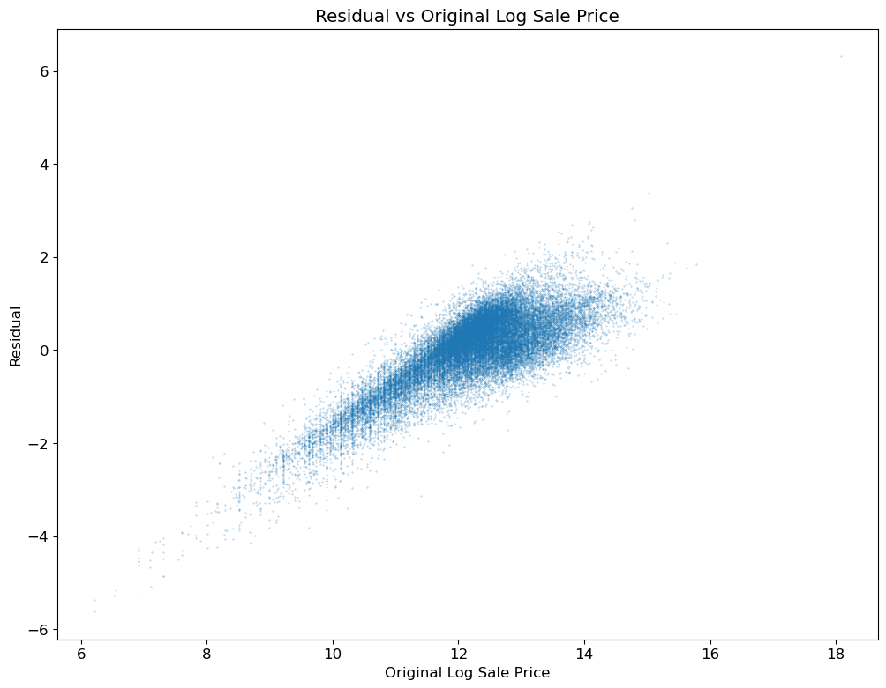
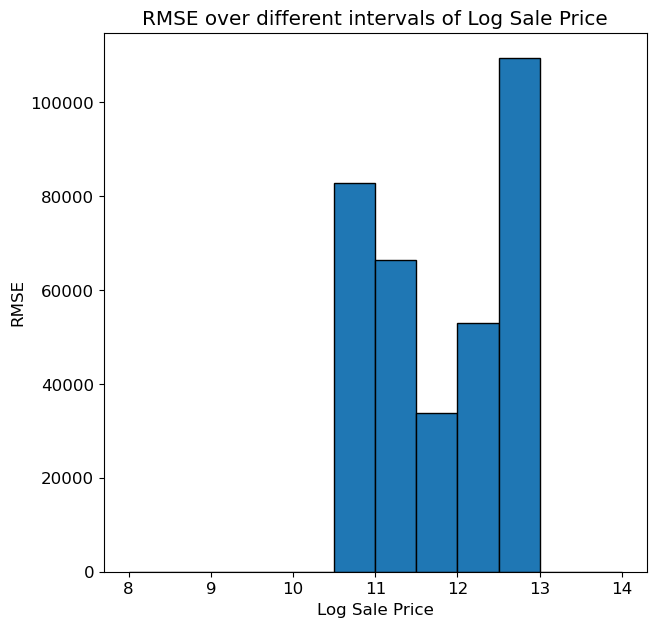

# 🏠 Cook County Housing Analysis

This project explores and models 2013 to 2019 residential sale prices in Cook County, IL, combining predictive accuracy with fairness diagnostics to reveal how assessment errors can reinforce systemic inequities.

## 🚀 Project Overview
- Load and clean a 200 K+ record sales dataset (`cook_county_train.csv`) and a hold-out test set (`cook_county_contest_test.csv`).
- Engineer features (log-transforms of area & assessor estimates, cubic terms for condition, total bedrooms, one-hot roof materials).
- Fit three linear models:
  1. **Model 1 (Bedrooms only)** – RMSE = 0.8674  
  2. **Model 2 (Bedrooms + Log Building Sq Ft)** – RMSE = 0.8059  
  3. **Final Model (13 features)** – RMSE = 0.3716
- Analyze residuals by true price strata to diagnose **regressive** bias (lower-value homes overvalued more than higher-value homes).
- Reflect on limitations, equity implications, and potential extensions.

## 📂 Files Included
### Root directory
- `.gitignore`
- `LICENSE`
- `README.md`
- `requirements.txt`
- `CookCountyAnalysis.ipynb`
- `cook-county-analysis.html`
- `download_data.py`
- `feature_func_inline.py`
- `submission_20250807_151903.csv`

### Data directory (`data/`)
- `codebook.txt`
- `cook_county_train.csv`
- `cook_county_train_val.csv`
- `cook_county_test.csv`
- `cook_county_contest_test.csv`

## 📊 Data
Place the data files listed above into a local `data/` folder, or run:
```bash
python download_data.py
```

## ⚙️ Environment & Setup
Recommended:
- Python 3.8+  
- Create a virtualenv and install:
  ```bash
  pip install -r requirements.txt
  ```
- Key dependencies:
  - pandas, numpy  
  - scikit-learn  
  - matplotlib, seaborn  

## 📓 Running the Analysis
Open and run the notebook:
```bash
jupyter notebook CookCountyAnalysis.ipynb
```
or view the rendered HTML:
```bash
open cook-county-analysis.html
```

## 📈 Key Results
| Model   | Features                         | RMSE (Log-Price) |
| ------- | -------------------------------- | ---------------- |
| Model 1 | Bedrooms                         | 0.8674           |
| Model 2 | Bedrooms + Log(Building Sq Ft)   | 0.8059           |
| Final   | 13 engineered features           | 0.3716           |

- **Interpretation**: RMSE decreased markedly across models from 0.87 (Model 1) to 0.81 (Model 2) to 0.37 (Final Model), highlighting how each feature engineering step cut error by over 57 % in total.  
- **Fairness**: Residual analysis shows **regressive** assessment bias where lower-value properties are overestimated more often, placing a heavier proportional burden on low-income homeowners.

## 🖼️ Sample Visuals

### Figure 1. Distribution of Log Sale Price  
  
*This histogram (top) with an overlaid KDE and matching boxplot (bottom) shows the bulk of transactions clustering between log-prices of 10.5–13 (≈$36K–$442K). The long right tail highlights a small number of very expensive homes.*

### Figure 2. Log Sale Price by Number of Bedrooms  
  
*Boxplots of log-prices broken out by bedroom count reveal a clear upward trend. Each additional bedroom shifts the median log-price upward by roughly 0.2–0.3. The wide whiskers and many outliers for mid-range bedroom counts underscore heterogeneity within those segments, motivating richer predictors beyond simple room counts.*

### Figure 3. Percentage of Homes Overestimated by Price Strata  
  
*Here we bin true log-prices into quintiles and compute the share of homes whose predicted value exceeds the actual sale price. The leftmost bins (lower-value homes) hit 100% overestimation, while higher-value bins drop to ~70% or lower, illustrating the **regressive** bias in our final model’s residuals.*

### Figure 4. Residuals vs. True Log Sale Price  
  
*Scatter of residuals (predicted – actual) against true log-price shows a strong positive slope: low-value homes (left) have mostly positive residuals (overestimation), whereas high-value homes (right) have more negative residuals (underestimation). This systematic tilt confirms regressive assessment errors.*

### Figure 5. RMSE by Price Strata  
  
*By computing RMSE within each log-price bin, we see error rising from ~$33K in the mid-range to over $100K for top-end homes (converted back from log scale). While overall RMSE is 0.37 (≈45%), this breakdown shows that absolute dollar errors are highest for the most expensive properties.*

## 📝 Conclusions & Next Steps
- **Conclusions**  
  - Feature engineering drove RMSE down from 0.87 → 0.37.  
  - Systematic overvaluation of inexpensive homes highlights regressive taxation patterns.  
- **Next Steps**  
  - Incorporate spatial variables or hierarchical models.  
  - Explore fairness-aware and nonlinear/ensemble algorithms.  
  - Build an interactive dashboard for stakeholders.  

## 📄 License & Citation
Feel free to fork, cite, or adapt this work for your own fairness-centered housing market analyses.

## ✍️ Author

**Jade Chen**  
[Portfolio](https://jad3ch3n.github.io/) | [LinkedIn](https://www.linkedin.com/in/jad3ch3n) | [GitHub](https://github.com/jad3ch3n)
